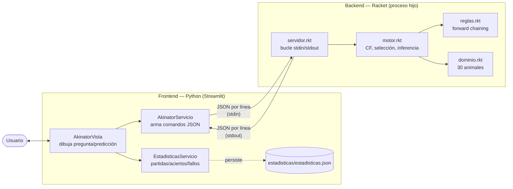
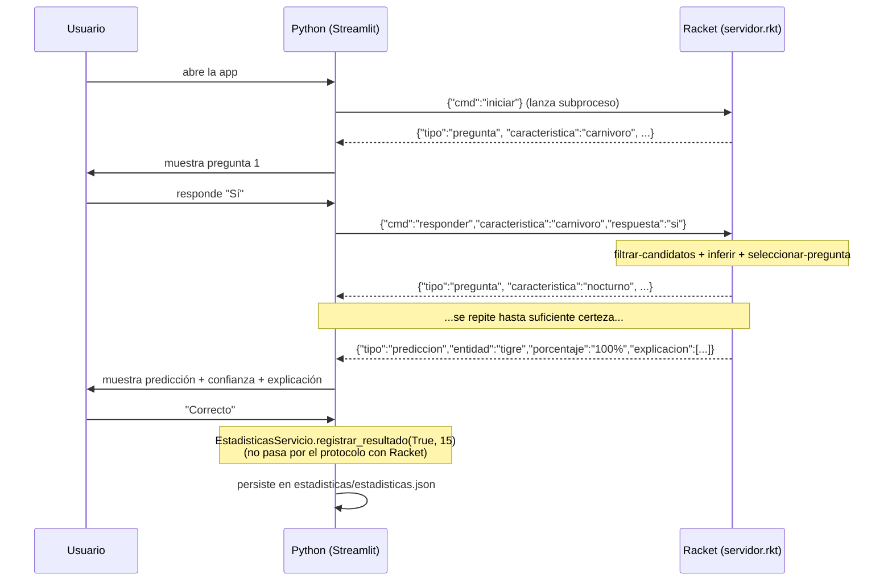

# Documento técnico — Sistema Experto Akinator (animales)

Proyecto integrador EIF400 — Sistema Experto Basado en Reglas tipo Akinator,
frontend Python + backend Scheme (Racket). Este documento complementa el
`README.md` (instalación y ejecución) con el detalle de arquitectura,
representación del conocimiento, motor de inferencia, heurística de
selección de preguntas, protocolo de comunicación, pruebas y conclusiones.

## 1. Arquitectura

El proyecto separa estrictamente el razonamiento (Scheme/Racket) de la
interacción (Python/Streamlit). Python nunca decide *qué* preguntar ni
*cómo* pesar una respuesta: solo dibuja lo que Racket le manda y traduce
los clics del usuario a comandos del protocolo. El estado del juego
(candidatos, historial de respuestas, contador de preguntas) vive y se
recalcula en Racket. Las estadísticas de uso de la app (partidas,
aciertos, fallos, promedio de preguntas) viven en Python: no requieren
inferencia ni conocimiento simbólico, son solo el conteo de lo que el
usuario ya le confirmó a la interfaz (botones "Correcto"/"Incorrecto") y
del número de preguntas que la propia interfaz ya mostró.



**Por qué un subproceso y no una librería o un servidor HTTP:** Racket y
Python corren en runtimes distintos con GIL/VM propios; un subproceso con
protocolo de línea es la forma más simple de lograr interoperabilidad sin
depender de FFI ni de infraestructura de red, y encaja con lo permitido
por el enunciado ("proceso externo, entrada/salida estándar... o
protocolo textual/JSON").

**Responsabilidades (tabla obligatoria del enunciado, sección 6):**

| Componente | Tecnología | Responsabilidad real en este proyecto |
|---|---|---|
| Frontend | Python (Streamlit) | GUI, historial de la partida en curso, estadísticas (partidas/aciertos/fallos/promedio) con su persistencia, traducción de clics a comandos JSON, presentación de pregunta/predicción/confianza/explicación |
| Backend | Racket | Base de conocimiento, hechos, reglas, motor CF, filtrado de candidatos, selección de pregunta, cálculo de confianza, explicación |

**Nota sobre estadísticas:** el enunciado ubica las estadísticas del lado
de Python (secciones 6 y 16), y así quedaron. Se consideró moverlas a
Racket por tratarse de estado persistente del juego, pero se optó por
mantener la lectura literal del enunciado: aciertos/fallos son el
resultado de un juicio del usuario sobre la predicción (los botones
"Correcto"/"Incorrecto"), no un cómputo simbólico sobre hechos y reglas,
así que no le pertenecen al motor de inferencia. Viven en
`frontend/estadisticas/`, una carpeta dedicada (modelo `Estadisticas`,
persistencia `EstadisticasRepositorio`, orquestación `EstadisticasServicio`)
en vez de estar dispersas en capas genéricas de "modelos"/"controlador" —
la app no tiene esas capas para nada más que no sea este dato concreto.

## 2. Base de conocimiento

`backend/dominio.rkt` define `conocimiento` como una lista de 30 animales,
cada uno con una lista de pares `(característica valor)` en representación
**dispersa**: solo se listan los rasgos relevantes para esa entidad
(mínimo 8 por entidad), no los ~26 posibles. Esto cumple el mínimo del
enunciado (30 entidades, 20+ características distintas, 8+ por entidad) y
es lo que permite agregar una entidad nueva **sin tocar el motor**: basta
con añadir una entrada a la lista.

```racket
(lobo (mamifero si)(salvaje si)(carnivoro si)(tiene-pelo si)(grande si)
      (tiene-cola si)(rapido si)(vive-en-selva si)(nocturno no)(vive-en-manada si))
```

Un rasgo ausente de la lista de una entidad no significa "no" — significa
"sin evidencia" (ver §3). Esta distinción de tres valores (`si` / `no` /
ausente) es la que le da al motor la capacidad de no penalizar
candidatos por preguntas que simplemente no aplican a su ficha.

## 3. Hechos y reglas

`backend/reglas.rkt` deriva hechos nuevos a partir de hechos existentes
mediante **10 reglas** de la forma `(antecedentes . consecuente)`, por
ejemplo `(tiene-plumas si) → (ave si)` o `(carnivoro si)(grande si)(salvaje si) → (peligroso si)`.

`aplicar-reglas` aplica pasadas sucesivas (`aplicar-reglas-una-pasada`,
implementada con `foldl` sobre la lista de reglas) hasta alcanzar un
**punto fijo** — recursión que se detiene cuando una pasada completa no
agrega hechos nuevos. Esto permite que una regla dispare sobre un hecho
derivado por otra regla anterior en la misma cadena (ej. `insecto` →
`pequeño` → `sigiloso` si además es `nocturno`), sin necesidad de ordenar
las reglas manualmente. `aplicar-reglas` se ejecuta una vez por entidad al
cargar el conocimiento (`cargar-conocimiento` en `motor.rkt`), enriqueciendo
sus hechos antes de empezar la partida.

## 4. Motor de inferencia (Factores de Certeza, estilo MYCIN)

`backend/motor.rkt` mantiene cada candidato como `(nombre CF hechos)`, con
`CF ∈ [-1, 1]`. Operaciones principales (todas `provide`d y cubiertas por
`tests/pruebas.rkt`):

- **`cargar-conocimiento`** — candidatos iniciales, CF 0.0, reglas aplicadas.
- **`cf-regla`** — consulta el hecho propio de la entidad: `+1` (sí), `-1`
  (no), o `'sin-evidencia` (el rasgo no está definido para esa entidad).
  Nunca devuelve `0` para no confundir "no aporta" con "aporta evidencia neutra".
- **`filtrar-candidatos`** — recalcula el CF de todos los candidatos tras
  una respuesta; solo combina evidencia cuando **ambos lados** la tienen
  (rasgo definido en la entidad y respuesta ≠ "no sé").
- **`combinar-cf`** — fórmula incremental de MYCIN, con las tres ramas
  (misma polaridad, polaridad opuesta, y guarda explícita de división por
  cero cuando dos evidencias de certeza total y signo contrario se
  combinan — probado en `pruebas.rkt`).
- **`inferir`** — decide `'prediccion` cuando el líder supera
  `umbral-cf = 0.6` con `margen-minimo = 0.3` sobre el segundo lugar, o
  (en un empate por saturación) cuando tiene estrictamente más
  coincidencias reales con el historial (`contar-coincidencias`); si no,
  `'continuar`.
- **`explicar`** — de todo el historial, cuáles respuestas coinciden con
  los hechos reales del candidato ganador (esas son las que más influyeron).
- **`reiniciar`** — vuelve a `cargar-conocimiento` desde cero.

### Respuestas y pesos (`backend/respuestas.rkt`)

| Respuesta | CF | Justificación |
|---|---|---|
| Sí | `0.9` | Certeza alta, no total |
| Probablemente | `0.6` | Evidencia positiva más débil |
| No sé | `0.0` (informativo; nunca se usa para combinar) | `filtrar-candidatos` ignora explícitamente esta respuesta |
| Probablemente no | `-0.6` | Evidencia negativa más débil |
| No | `-0.9` | Certeza alta, no total |

Se usó `±0.9` en vez de `±1.0` porque la combinación de MYCIN es
absorbente en `±1.0`: una sola respuesta coincidente saturaría a `CF=1.0`
a *todos* los candidatos que comparten ese rasgo (por ejemplo, todos los
mamíferos grandes y salvajes) y ya no podrían volver a separarse entre sí.

## 5. Selección inteligente de preguntas

`seleccionar-pregunta` (motor.rkt) nunca repite una característica ya
preguntada y elige la que mejor **discrimina** entre los candidatos aún
vivos (CF ≥ 0), usando balance de partición:

- `contar-particion` cuenta cuántos candidatos vivos tienen el rasgo en
  `si` contra el resto.
- `puntaje-discriminacion` = tamaño del lado más chico de esa partición —
  entre más parejo el corte, más información aporta la pregunta.
- Se elige la característica con mayor puntaje (`argmax`).

## 6. Comunicación Python-Scheme

Subproceso persistente (`racket servidor.rkt`), un objeto JSON por línea
en stdin/stdout; Racket hace `flush-output` tras cada respuesta para que
el `readline()` bloqueante de Python nunca se quede esperando buffer.
Protocolo completo, comandos, tipos de respuesta y manejo de errores están
documentados en el `README.md` (sección "Protocolo de comunicación").



Manejo de errores: si el ejecutable `racket` no está en el `PATH` o
`backend/servidor.rkt` no existe, `ClienteScheme` lanza
`FileNotFoundError`/`RuntimeError` **antes** de intentar levantar el
subproceso, y `app.py` lo muestra como un `st.error` legible en vez de
tumbar la app. Si el subproceso Racket muere a mitad de partida (`poll()`
≠ `None`, o `readline()` devuelve cadena vacía), `ClienteScheme.enviar`
lanza `RuntimeError` con el `stderr` capturado. Del lado Racket,
`procesar-linea` envuelve cada comando en `with-handlers` sobre
`exn:fail?` y responde `{"tipo":"error","mensaje":...}` en vez de tumbar
el subproceso completo (por ejemplo, ante un JSON malformado o un comando
desconocido).

## 7. Explicabilidad

Cuando el motor predice, `explicar` filtra el historial de respuestas a
las que son consistentes con los hechos propios del candidato ganador
(`(valor-de rasgo hechos-ganador)` coincide con el signo de la respuesta
dada). Esas son, literalmente, las respuestas que más contribuyeron a que
ese candidato ganara. `servidor.rkt` las serializa como lista de nombres
de característica en el campo `"explicacion"`, y `AkinatorVista` las
muestra como *"Me basé en: nocturno, salvaje, rápido..."* junto al
porcentaje de certeza (`round(100 * certeza)`).

## 8. Pruebas y casos límite

`backend/tests/pruebas.rkt` (rackunit) cubre, entre otras cosas, los 5
casos obligatorios del enunciado (sección 18):

| # | Caso | Cómo se prueba |
|---|---|---|
| 1 | Entidad claramente identificable | `"demo tigre: converge en el candidato correcto"` — predicción correcta en 15 preguntas |
| 2 | Entidades muy similares | `"caso 2 (obligatorio): ... las 30 convergen a si mismas"` — las 30 entidades del dominio, incluyendo el par más parecido (*lobo*/*tigre*), llegan a su propia predicción con sus propios hechos |
| 3 | Respuesta "No sé" | `"filtrar-candidatos no toca un candidato sin evidencia real"` — ningún CF se mueve ante `'no-se` |
| 4 | Respuestas probabilísticas | `"caso 4 (obligatorio): respuestas probabilisticas cambian la confianza de forma coherente"` — `probablemente`/`probablemente-no` mueven el CF en la misma dirección que `si`/`no` pero con menor magnitud, nunca invierten el signo |
| 5 | Entidad desconocida/ambigua | `"caso 5 (obligatorio): entidad ambigua sin certeza suficiente"` — al agotarse las preguntas (`seleccionar-pregunta` devuelve `#f`) sin alcanzar `umbral-cf`, se reporta el mejor candidato vía `mejores-dos`, nunca una `'prediccion` |

Además: rango `[-1,1]` nunca violado sobre las 30 entidades, guarda de
división por cero forzada explícitamente, punto fijo real del motor de
reglas (una pasada extra no agrega hechos), y "el motor nunca predice una
entidad incorrecta" sobre las 30 entidades. El frontend tiene su propia
suite (`frontend/tests/`, pytest, 17 pruebas): `AkinatorServicio` con un
`ClienteScheme` falso (sin tocar la lógica real de comunicación), y
`Estadisticas`/`EstadisticasRepositorio`/`EstadisticasServicio` con
archivos temporales y un repositorio falso — cada capa probada de forma
aislada con TDD (rojo antes de verde en cada una).

Correr todo: `cd backend && raco test tests/pruebas.rkt` (Racket) y
`cd frontend && uv run pytest` (Python) — ver `README.md`.

## 9. Conclusiones

- El motor de inferencia reside enteramente en Scheme y participa de
  forma efectiva (no decorativa): Python nunca decide una pregunta, un
  peso o una predicción, solo los presenta.
- La representación dispersa del conocimiento y la separación
  dominio/reglas/motor permiten agregar entidades o reglas sin tocar el
  núcleo del motor.
- El principal reto técnico fue evitar la saturación de la fórmula de
  MYCIN en `±1.0` (rasgos muy compartidos, como "mamífero" o "salvaje",
  saturarían a todos los candidatos por igual); se resolvió acotando el
  peso de las respuestas a `±0.9`/`±0.6` y agregando desempate por
  coincidencias reales.
- El caso límite más difícil del dominio (*lobo* vs. *tigre*, que
  compartían los 8 mismos rasgos) se resolvió agregando dos rasgos reales
  y verificables (`nocturno`, `vive-en-manada`) en vez de ajustar el
  motor — la solución correcta a "dos entidades demasiado parecidas" es
  mejorar el conocimiento, no relajar el umbral de confianza.
